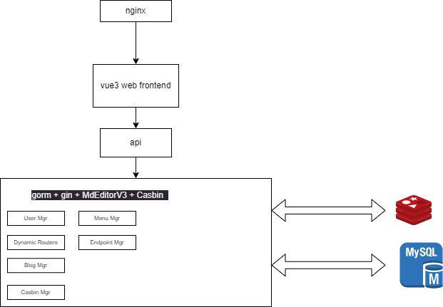

# blog
a blog project
frontend: vue3 + dayjs + elementPlus
backend:  gin + gorm + casbin + minio + zap
db: mysql + redis
deploy: github runner + docker-compose + nginx
server: ali-cloud ec2

demo: http://blog.easydelivery.ltd/
guestLogin: 'guest'
guestPassword: '123qwe!@#QWE'

TOOD:
<!-- - [x] ~~~add README~~ -->
- [x] ~~~add README
- [x] Article preview/editing
- [ ] Add comments
